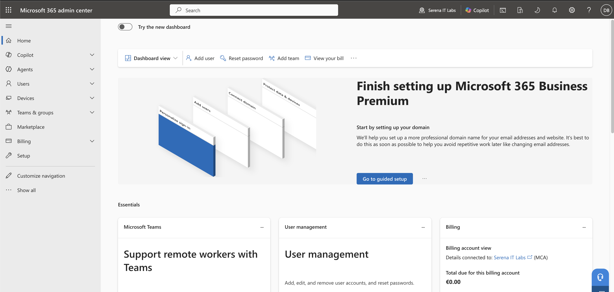
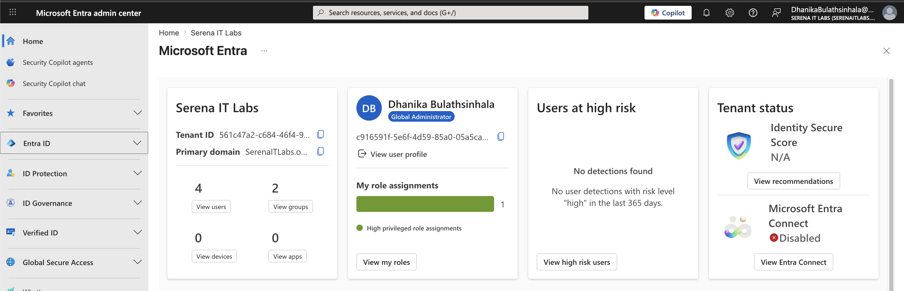
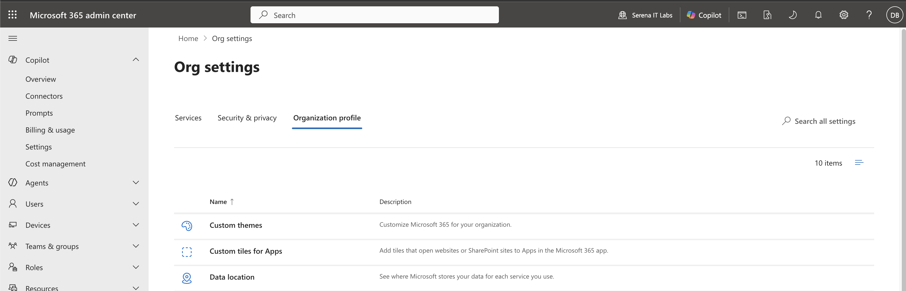
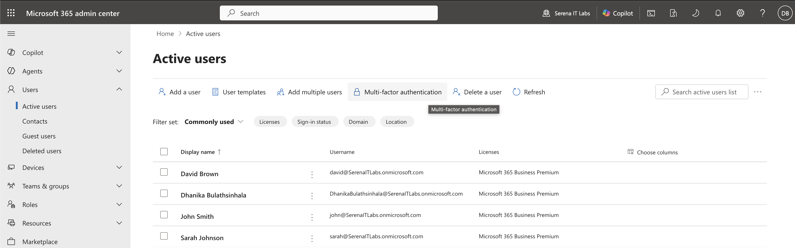
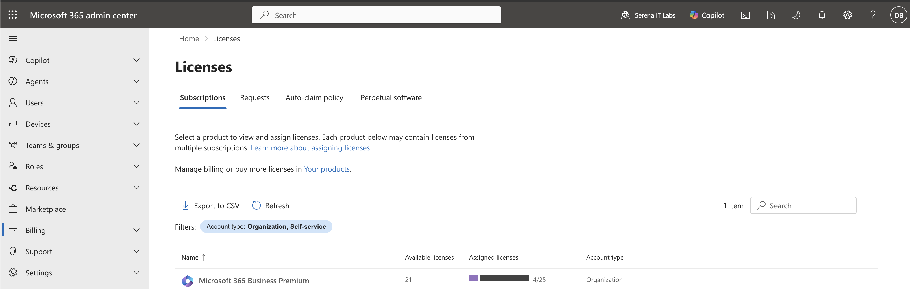

# Project 01 – Microsoft 365 Tenant Setup

## Overview

This project documents the initial setup and exploration of a Microsoft 365 Business Premium tenant. The objective was to become familiar with the primary administrative portals and understand the core components used to manage users, identities, licenses, and organizational settings.

---

## Scenario

An organization has deployed Microsoft 365 Business Premium and requires an administrator to review the newly provisioned tenant and verify access to the essential administration interfaces.

The administrator reviews the Microsoft 365 Admin Center, Microsoft Entra Admin Center, organization profile, active users, and available licenses before beginning day-to-day administration.

---

## Objectives

- Access the Microsoft 365 Admin Center
- Review the Microsoft 365 administration dashboard
- Access the Microsoft Entra Admin Center
- Review tenant and organization information
- Review active users
- Review Microsoft 365 licenses
- Become familiar with the Microsoft 365 administration environment

---

## Lab Environment

| Component | Details |
|----------|---------|
| Microsoft 365 Plan | Microsoft 365 Business Premium |
| Administration Portal | Microsoft 365 Admin Center |
| Identity Platform | Microsoft Entra ID |
| Identity Administration | Microsoft Entra Admin Center |
| Environment | Cloud-based Microsoft 365 Tenant |

---

## Project Structure

```text
01-Microsoft-365-Tenant-Setup
├── README.md
├── Notes
│   └── Analysis.md
└── Screenshots
    ├── 01_Admin_Center_Home.png
    ├── 02_Entra_Overview.png
    ├── 03_Organization_Profile.png
    ├── 04_Active_Users.png
    └── 05_Licenses.png
```

---

## Lab Steps

1. Accessed the Microsoft 365 Admin Center.
2. Switched from Simplified view to Dashboard view.
3. Reviewed the Microsoft 365 administration dashboard.
4. Accessed the Microsoft Entra Admin Center.
5. Reviewed the Microsoft Entra ID tenant overview.
6. Reviewed the Microsoft 365 organization profile.
7. Reviewed active user accounts.
8. Reviewed the Microsoft 365 Business Premium licensing information.
9. Documented the tenant administration environment.

---

## Microsoft 365 Admin Center

The Microsoft 365 Admin Center provides centralized access to common administrative functions, including user management, groups, licenses, billing, organizational settings, and additional Microsoft 365 administration centers.



---

## Microsoft Entra Admin Center

Microsoft Entra ID provides identity and access management capabilities for the Microsoft 365 environment.



---

## Organization Profile

The organization profile contains tenant-level information and configuration settings.



---

## Active Users

The Active Users interface provides centralized management of Microsoft 365 user accounts.



---

## License Management

The licensing interface provides visibility into available Microsoft 365 subscriptions and license allocation.



---

## Skills Demonstrated

- Microsoft 365 Admin Center navigation
- Microsoft Entra Admin Center navigation
- Microsoft Entra ID fundamentals
- Microsoft 365 tenant administration
- User administration fundamentals
- Microsoft 365 license management fundamentals
- Cloud administration
- Technical documentation

---

## Lessons Learned

- The Microsoft 365 Admin Center provides centralized management for Microsoft 365 services.
- Microsoft Entra ID manages identities and access within the Microsoft 365 environment.
- Administrators can manage users, licenses, and organizational settings through dedicated administration interfaces.
- Licensing determines which Microsoft 365 services are available to users.
- Understanding the Microsoft 365 administrative portals is essential before performing user lifecycle and service administration tasks.

---

## Next Project

**Project 02 – Microsoft 365 User & Group Administration**

The next project will focus on practical user administration tasks, including creating user accounts, resetting passwords, assigning licenses, creating groups, and managing group membership.