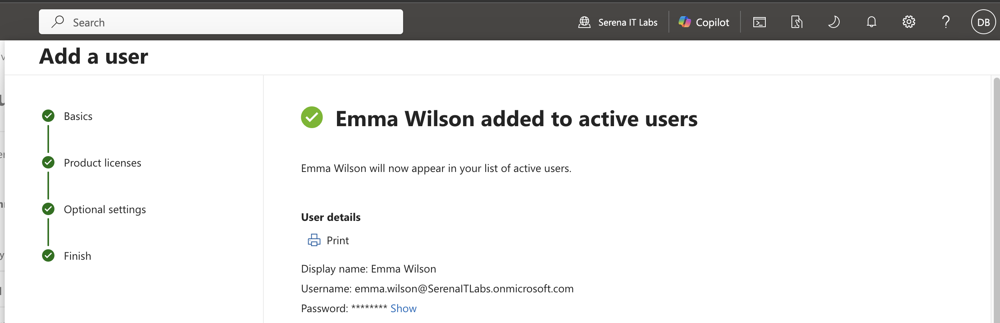
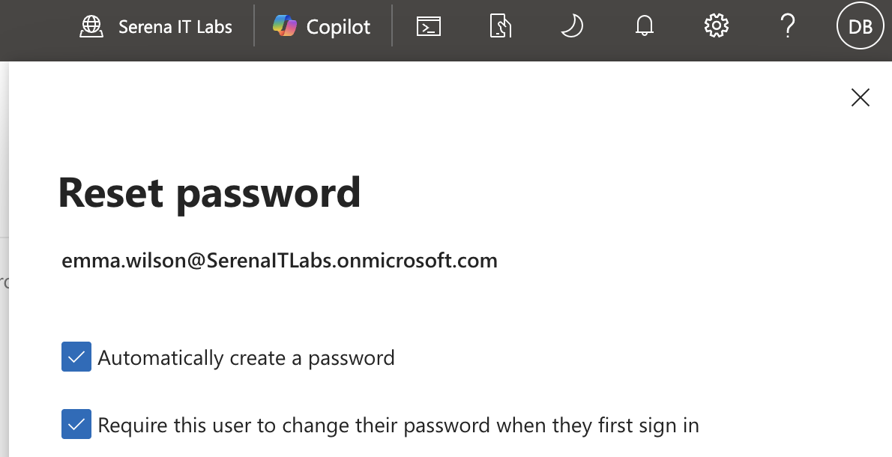
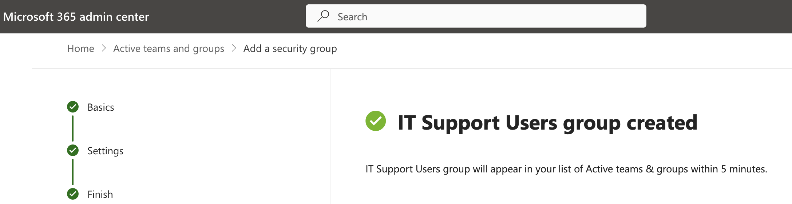
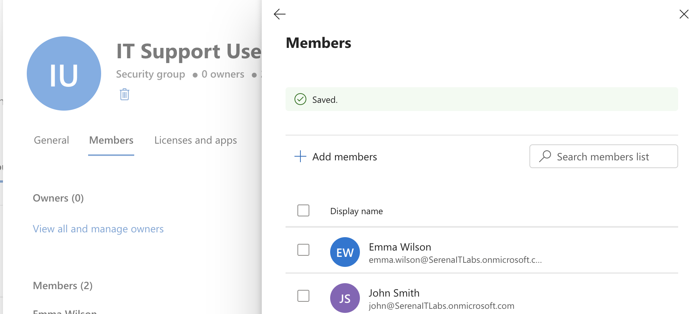
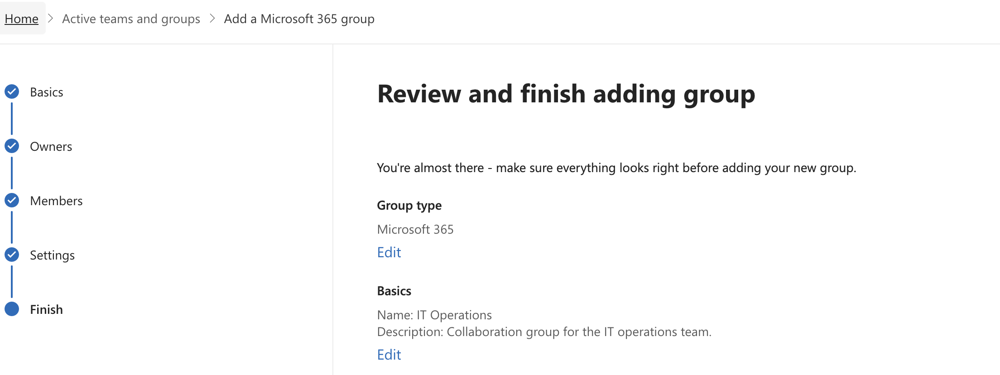
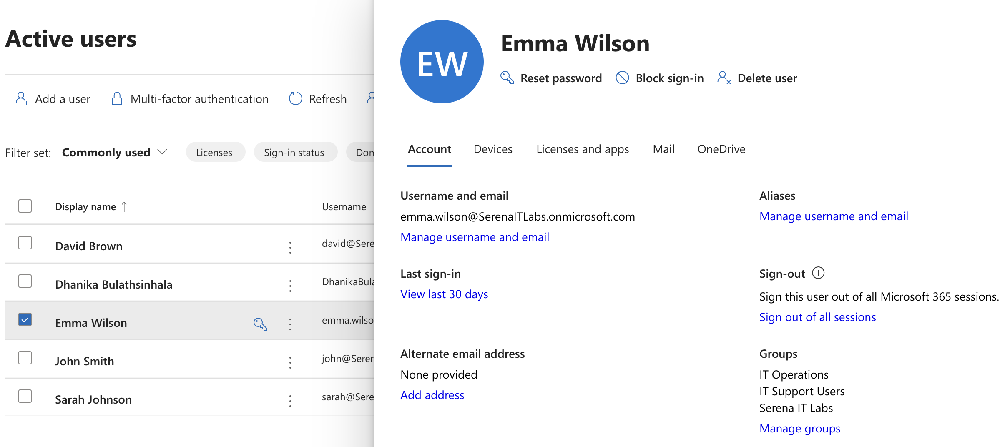

# Project 02 – Microsoft 365 User & Group Administration

## Overview

This project demonstrates practical Microsoft 365 user and group administration tasks commonly performed by IT Support and Microsoft 365 administrators.

The lab focused on creating and managing a user account, resetting a password, assigning a license, creating security and Microsoft 365 groups, and managing group membership.

---

## Scenario

A new employee joins the organization and requires a Microsoft 365 account, license assignment, and access to appropriate organizational groups.

As the Microsoft 365 administrator, the task is to create the user account, manage credentials, assign licensing, and configure group membership to provide the required access.

---

## Objectives

- Create a Microsoft 365 user account
- Assign a Microsoft 365 Business Premium license
- Reset a user password
- Create a security group
- Manage security group membership
- Create a Microsoft 365 group
- Assign group owners and members
- Review user account settings

---

## Lab Environment

| Component | Details |
|----------|---------|
| Microsoft 365 Plan | Microsoft 365 Business Premium |
| Administration Portal | Microsoft 365 Admin Center |
| Identity Platform | Microsoft Entra ID |
| Environment | Cloud-based Microsoft 365 Tenant |

---

## Project Structure

```text
02-User-and-Group-Administration
├── README.md
└── Screenshots
    ├── 01_User_Created.png
    ├── 02_Password_Reset.png
    ├── 03_Security_Group.png
    ├── 04_Group_Members.png
    ├── 05_Microsoft_365_Group.png
    └── 06_User_Administration.png
```

---

## Lab Steps

1. Accessed the Microsoft 365 Admin Center.
2. Created a new user account for Emma Wilson.
3. Assigned a Microsoft 365 Business Premium license.
4. Configured the account as a standard user with no administrative privileges.
5. Performed a password reset for the user account.
6. Created a security group named `IT Support Users`.
7. Added selected users to the security group.
8. Created a Microsoft 365 group named `IT Operations`.
9. Assigned an administrator account as the group owner.
10. Added lab users as group members.
11. Configured the Microsoft 365 group as private.
12. Reviewed the user's account, licensing, group membership, and service settings.

---

## User Creation

A new Microsoft 365 user account was created and assigned a Microsoft 365 Business Premium license.



---

## Password Reset

The user's password was reset through the Microsoft 365 Admin Center.

This demonstrated a common help desk task performed when users forget passwords or require temporary credentials.



---

## Security Group Management

A security group named `IT Support Users` was created to manage access for users requiring IT support resources.



---

## Group Membership

Users were added to the `IT Support Users` security group.

This demonstrated centralized access management through group membership.



---

## Microsoft 365 Group

A Microsoft 365 group named `IT Operations` was created to support collaboration between members of the IT operations team.

The group was configured with:

- An administrator as the group owner
- Lab users as members
- A dedicated group email address
- Private membership



---

## User Administration

The user's administration page was reviewed to examine:

- Account information
- Assigned licenses
- Microsoft 365 applications
- Group membership
- Mail settings



---

## Skills Demonstrated

- Microsoft 365 user administration
- User account provisioning
- Microsoft 365 license assignment
- Password reset procedures
- Security group creation
- Group membership management
- Microsoft 365 group administration
- User lifecycle management fundamentals
- Access management
- Microsoft 365 Admin Center navigation

---

## Lessons Learned

- Microsoft 365 administrators can centrally manage user accounts through the Microsoft 365 Admin Center.
- Licensing determines which Microsoft 365 services a user can access.
- Password resets are a common help desk responsibility.
- Security groups provide a scalable method for controlling access to organizational resources.
- Microsoft 365 groups support collaboration through shared services such as email and other Microsoft 365 resources.
- Group owners and members should be assigned according to organizational responsibilities.
- User and group administration are core components of Microsoft 365 identity and access management.

---

## Next Project

**Project 03 – Microsoft 365 License Management**

The next project focuses on managing Microsoft 365 licenses, reviewing license availability, assigning and removing licenses, and understanding how licensing affects user access to Microsoft 365 services.