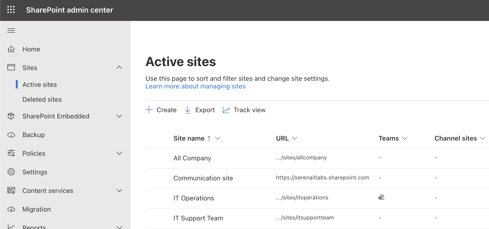
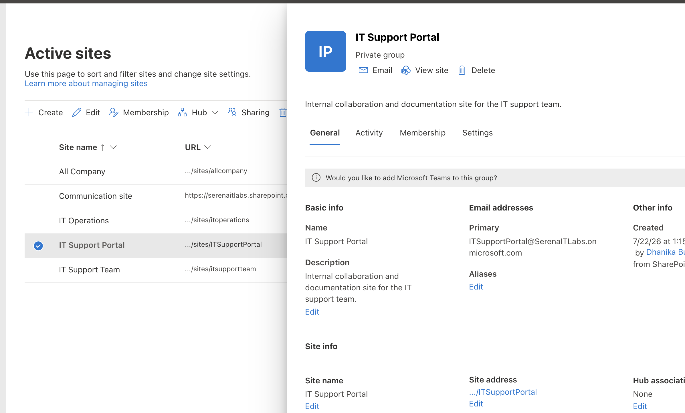
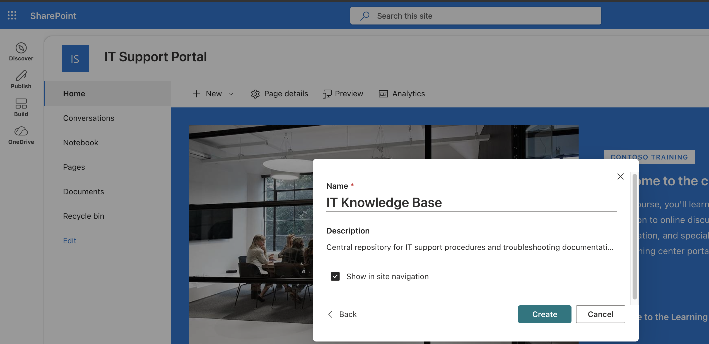
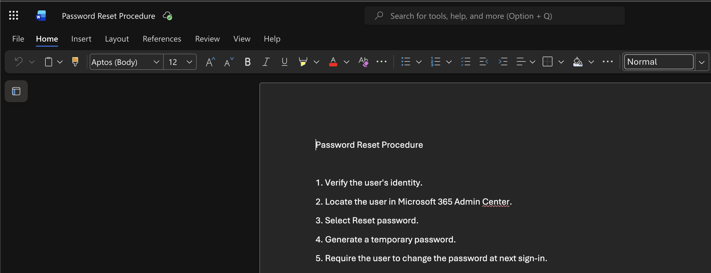
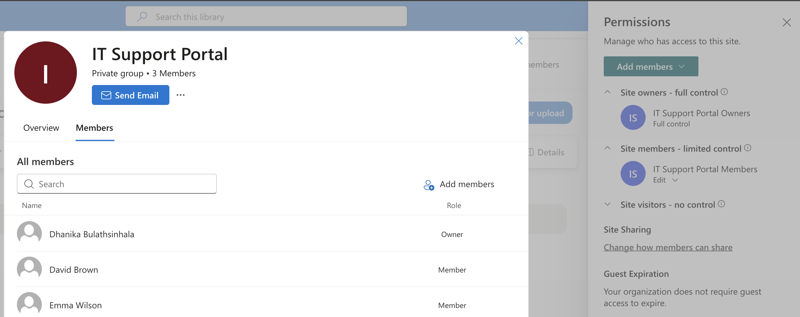
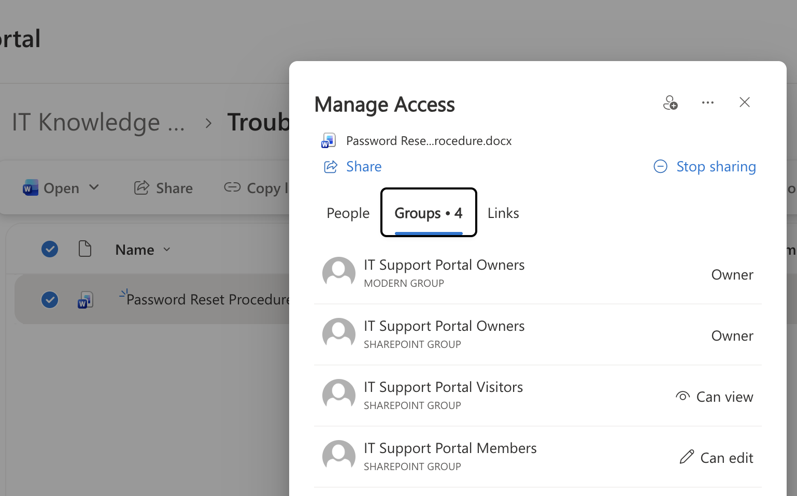
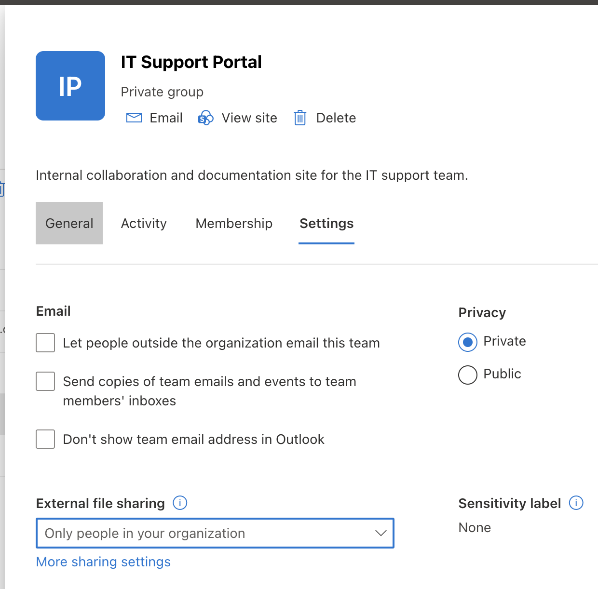
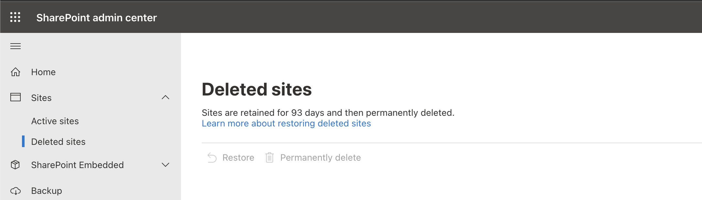

# Project 06 – SharePoint Online Administration

## Overview

This project demonstrates practical SharePoint Online administration within a Microsoft 365 Business Premium environment.

The lab focused on creating and managing a SharePoint team site, configuring a document library, organizing IT knowledge-base content, managing site and file permissions, reviewing external sharing controls, and examining deleted-site recovery options.

---

## Scenario

An organization's IT department requires a centralized SharePoint portal for internal support documentation and collaboration.

As the Microsoft 365 administrator, the task is to create an IT Support site, configure a dedicated knowledge-base library, manage access permissions, control sharing settings, and review recovery options used in day-to-day SharePoint administration.

---

## Objectives

- Navigate the SharePoint Admin Center
- Create a SharePoint team site
- Configure a private internal site
- Create a dedicated document library
- Organize IT support documentation
- Manage site owners and members
- Review file-level access
- Review external sharing settings
- Review deleted-site recovery

---

## Lab Environment

| Component | Details |
|---|---|
| Microsoft 365 Plan | Microsoft 365 Business Premium |
| Administration Portal | SharePoint Admin Center |
| Collaboration Platform | SharePoint Online |
| Identity Platform | Microsoft Entra ID |
| Environment | Cloud-based Microsoft 365 Tenant |

---

## Project Structure

```text
06-SharePoint-Online-Administration
├── README.md
└── Screenshots
    ├── 01_SharePoint_Admin_Center.png
    ├── 02_IT_Support_Site.png
    ├── 03_IT_Knowledge_Base.png
    ├── 04_Knowledge_Base_Content.png
    ├── 05_Site_Permissions.png
    ├── 06_File_Access.png
    ├── 07_External_Sharing.png
    └── 08_Deleted_Sites.png
```

---

## Lab Steps

1. Accessed the SharePoint Admin Center.
2. Reviewed the Active sites administration interface.
3. Created a private SharePoint team site named `IT Support Portal`.
4. Assigned an administrator as the site owner.
5. Added lab users as site members.
6. Created a document library named `IT Knowledge Base`.
7. Created a `Troubleshooting Guides` folder.
8. Added a sample `Password Reset Procedure` document.
9. Reviewed site owners, members, and visitors.
10. Reviewed individual file access and sharing controls.
11. Reviewed site-level external sharing settings.
12. Reviewed the Deleted sites administration area used for SharePoint site recovery.

---

## SharePoint Admin Center

The SharePoint Admin Center provides centralized administration of SharePoint Online sites, sharing settings, storage, permissions, and site lifecycle management.



---

## IT Support Portal

A private SharePoint team site named `IT Support Portal` was created to provide a centralized collaboration and documentation workspace for the IT support team.



---

## IT Knowledge Base

A dedicated document library named `IT Knowledge Base` was created to organize internal IT procedures and troubleshooting documentation.



---

## Knowledge Base Content

A `Troubleshooting Guides` folder and sample password-reset procedure were added to demonstrate how internal IT documentation can be organized within SharePoint.



---

## Site Permissions

Site permissions were reviewed to verify the appropriate assignment of owners, members, and other access levels.

This demonstrates role-based access management within a SharePoint site.



---

## File-Level Access

Individual document access was reviewed using SharePoint's sharing and access-management controls.

This demonstrates the difference between general site membership and access granted directly to specific files.



---

## External Sharing

The site's external sharing configuration was reviewed to understand how administrators can restrict or permit collaboration with users outside the organization.

For the internal IT Support Portal, sharing was configured or reviewed with an organization-only access model.



---

## Deleted Site Recovery

The Deleted sites administration area was reviewed to understand how SharePoint administrators can manage site recovery following accidental deletion.



---

## Skills Demonstrated

- SharePoint Online administration
- SharePoint Admin Center navigation
- SharePoint site creation
- Team site administration
- Document library management
- IT knowledge-base organization
- Site permission management
- File-level access management
- External sharing administration
- SharePoint recovery awareness
- Microsoft 365 collaboration administration

---

## Lessons Learned

- SharePoint Online can be used as a centralized platform for internal documentation and collaboration.
- Site owners, members, and visitors provide different levels of access.
- Document libraries allow organizations to structure and manage shared content.
- Knowledge-base content can be organized using folders and document libraries.
- File-level sharing can provide access without changing overall site membership.
- External sharing settings should be configured according to organizational security requirements.
- Deleted-site management provides an important recovery capability for administrators.
- SharePoint permissions and access troubleshooting are common Microsoft 365 support responsibilities.

---

## Next Project

**Project 07 – OneDrive Administration**

The next project focuses on OneDrive user storage, sharing controls, file recovery, and synchronization-related administration.

---

**Status:** Completed