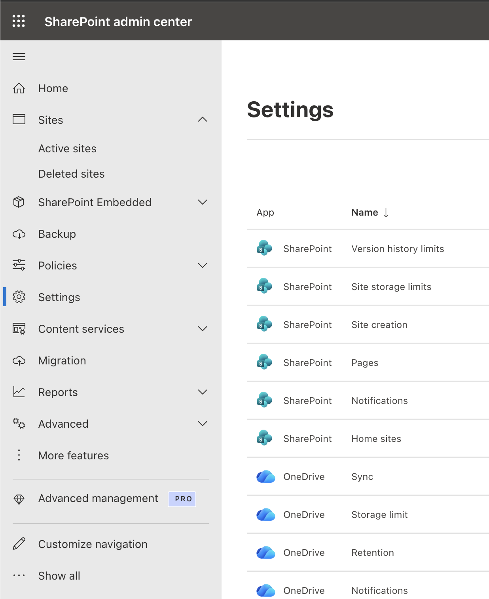
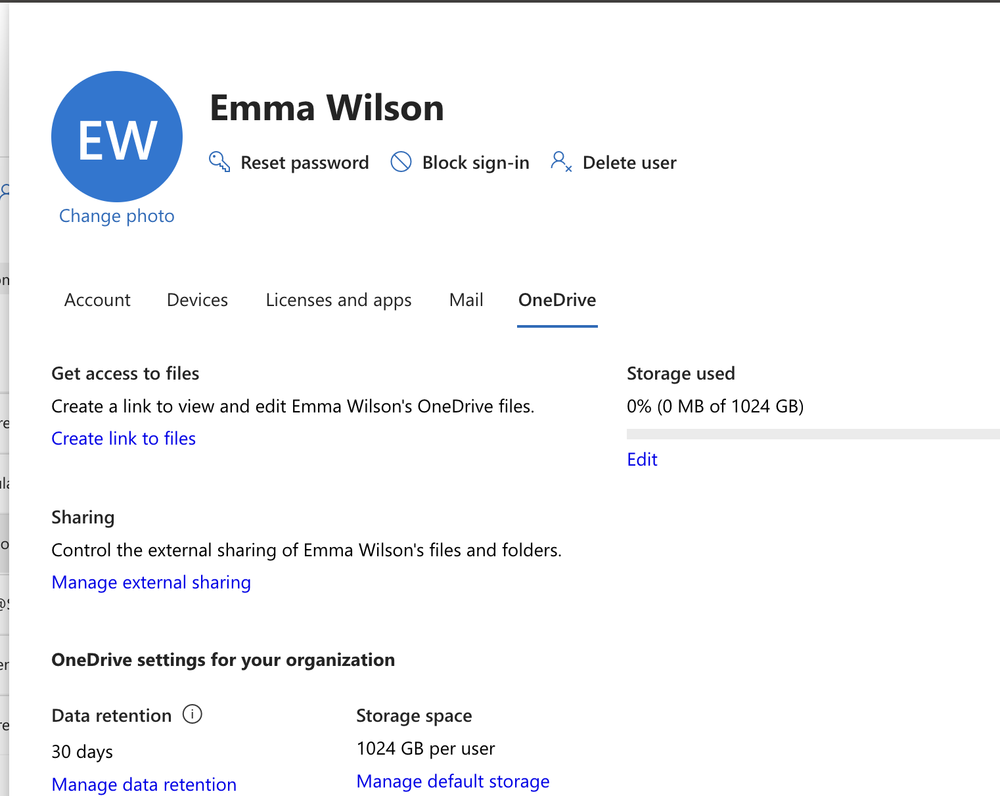
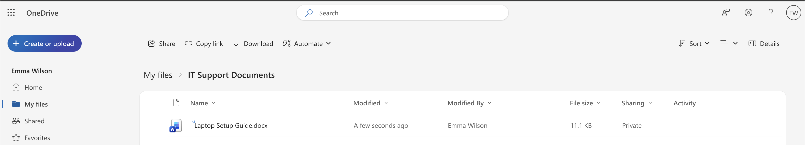
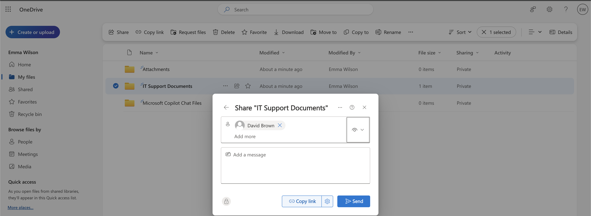
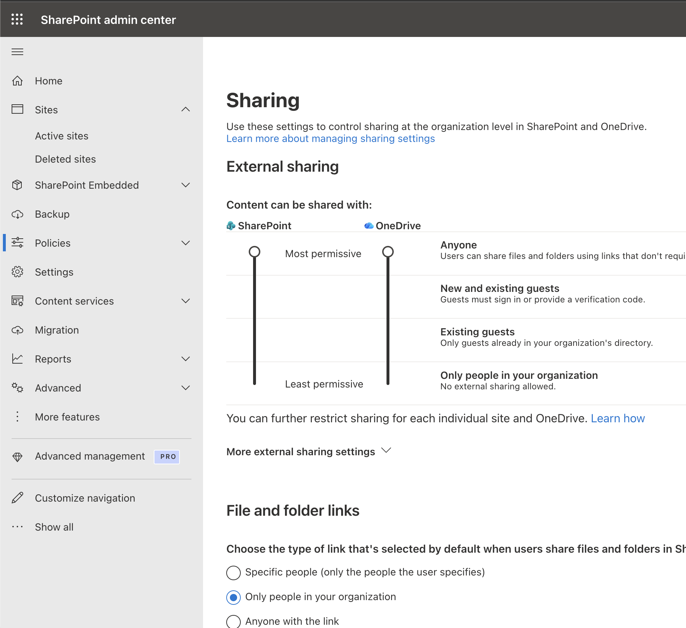
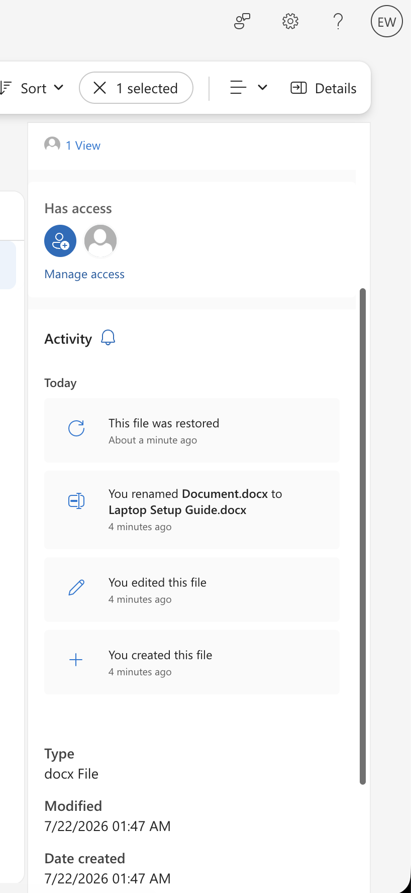
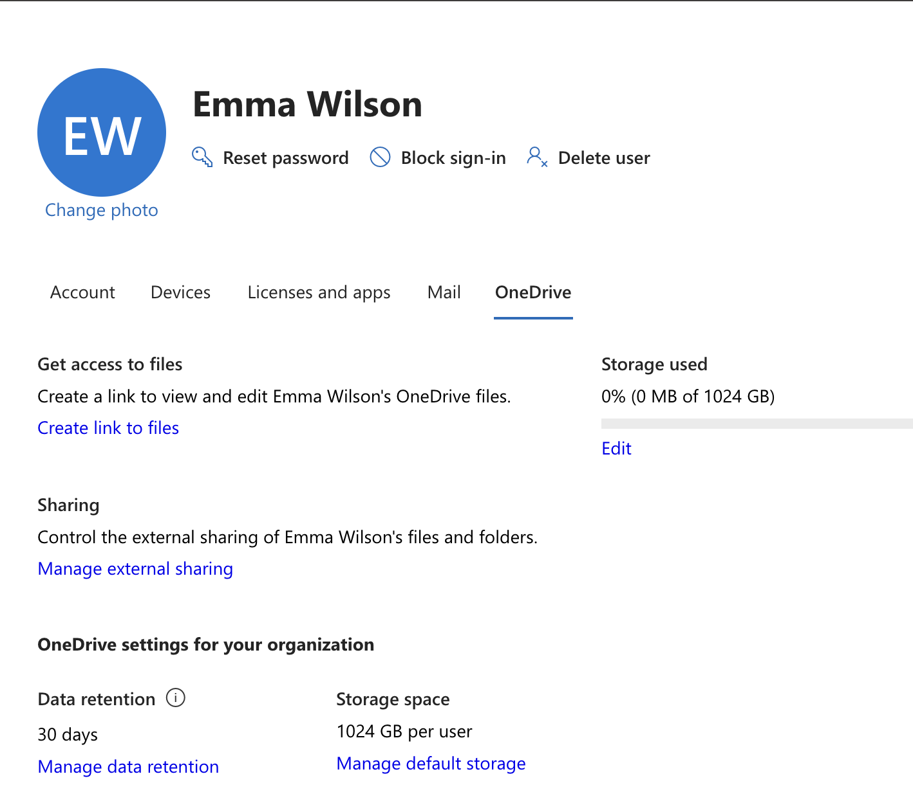

# Project 07 – OneDrive Administration

## Overview

This project demonstrates practical OneDrive administration within a Microsoft 365 Business Premium environment.

The lab focused on provisioning a user's OneDrive environment, managing user storage, creating and sharing content, reviewing organizational sharing controls, restoring deleted files, and reviewing administrative access and retention-related settings.

---

## Scenario

A Microsoft 365 user requires OneDrive for storing and sharing work-related documents.

As the Microsoft 365 administrator, the task is to provision and review the user's OneDrive environment, configure controlled file sharing, examine organizational sharing policies, test file recovery, and review administrative options for managing user OneDrive data.

---

## Objectives

- Review OneDrive administration settings
- Provision a user's OneDrive environment
- Review user OneDrive information
- Create and organize OneDrive content
- Configure file sharing
- Review OneDrive sharing policies
- Restore a deleted file
- Review administrative access and retention-related settings

---

## Lab Environment

| Component | Details |
|---|---|
| Microsoft 365 Plan | Microsoft 365 Business Premium |
| Administration Portal | Microsoft 365 Admin Center |
| Storage Platform | OneDrive for Business |
| Administration Platform | SharePoint Admin Center |
| Identity Platform | Microsoft Entra ID |
| Environment | Cloud-based Microsoft 365 Tenant |

---

## Project Structure

```text
07-OneDrive-Administration
├── README.md
└── Screenshots
    ├── 01_OneDrive_Admin_Settings.png
    ├── 02_User_OneDrive.png
    ├── 03_OneDrive_Content.png
    ├── 04_File_Sharing.png
    ├── 05_OneDrive_Sharing_Policy.png
    ├── 06_File_Restore.png
    └── 08_OneDrive_Admin_Access.png
```

---

## Lab Steps

1. Accessed OneDrive administration settings through the Microsoft 365 and SharePoint administration interfaces.
2. Reviewed the OneDrive environment for a lab user.
3. Provisioned the user's OneDrive by signing into OneDrive with the lab account.
4. Verified that the user's OneDrive environment was successfully created.
5. Created an `IT Support Documents` folder.
6. Added a sample IT support document.
7. Reviewed file sharing and access-management options.
8. Granted controlled access to another lab user.
9. Reviewed organizational OneDrive sharing policies.
10. Deleted a test file to simulate accidental deletion.
11. Accessed the OneDrive Recycle Bin and restored the deleted file.
12. Reviewed available administrative access, storage, and retention-related settings for the user's OneDrive.

---

## OneDrive Administration Settings

OneDrive administration settings were reviewed to understand how Microsoft 365 administrators manage organizational OneDrive configuration.



---

## User OneDrive Provisioning

The lab user's OneDrive environment was provisioned and reviewed.

This demonstrated how a user's OneDrive storage becomes available within the Microsoft 365 environment.



---

## OneDrive Content Management

A folder named `IT Support Documents` was created to demonstrate how users can organize work-related files within OneDrive.

A sample IT support document was added to the folder.



---

## File Sharing and Access Management

File-sharing options were reviewed and controlled access was granted to another lab user.

This demonstrated how OneDrive can be used to securely share organizational files without making them publicly accessible.



---

## OneDrive Sharing Policy

Organization-level OneDrive sharing settings were reviewed through the administrative interface.

These settings allow administrators to control how users can share OneDrive content within or outside the organization.



---

## File Recovery

A test file was deleted to simulate accidental user deletion.

The OneDrive Recycle Bin was then used to restore the deleted file.

This demonstrated a common IT support recovery workflow for user files.



---

## Administrative Access

Administrative options related to the user's OneDrive environment were reviewed, including available storage, access, and retention-related settings.

These capabilities are important when supporting users and managing organizational data throughout the user lifecycle.



---

## Skills Demonstrated

- OneDrive for Business administration
- OneDrive user provisioning
- Microsoft 365 storage administration
- File and folder management
- OneDrive sharing and permissions
- Access management
- Organizational sharing policy review
- OneDrive file recovery
- Recycle Bin restoration
- User data administration
- Microsoft 365 Admin Center navigation
- SharePoint Admin Center navigation

---

## Lessons Learned

- OneDrive provides cloud-based storage for individual Microsoft 365 users.
- A user's OneDrive environment may require provisioning before administrative information becomes available.
- OneDrive enables controlled sharing of files with other organizational users.
- Organization-level sharing policies help administrators control how OneDrive content can be shared.
- Deleted OneDrive files can be recovered through the Recycle Bin when they remain within the applicable retention period.
- Administrative access to user OneDrive data is important for support and user lifecycle scenarios.
- OneDrive administration works closely with SharePoint Online administration within Microsoft 365.

---

## Next Project

**Project 08 – Microsoft 365 Security & Identity Administration**

The next project will focus on Microsoft 365 security and identity administration, including authentication, MFA, security settings, administrative roles, and sign-in monitoring.

---

**Status:** Completed