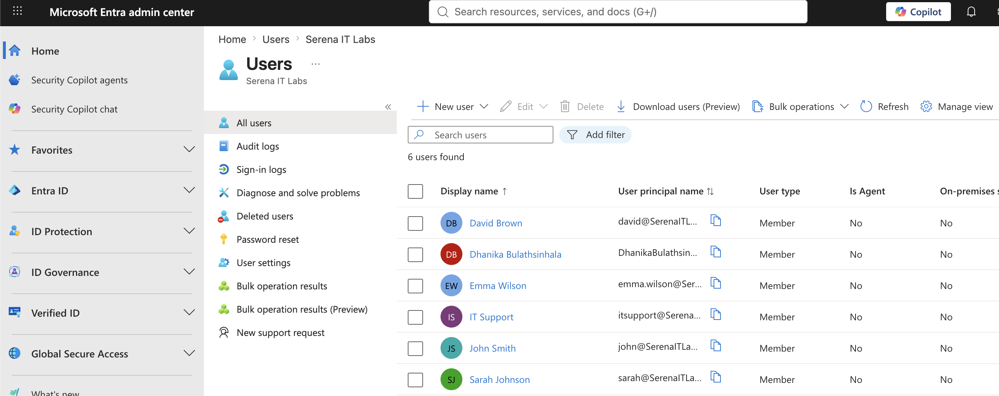
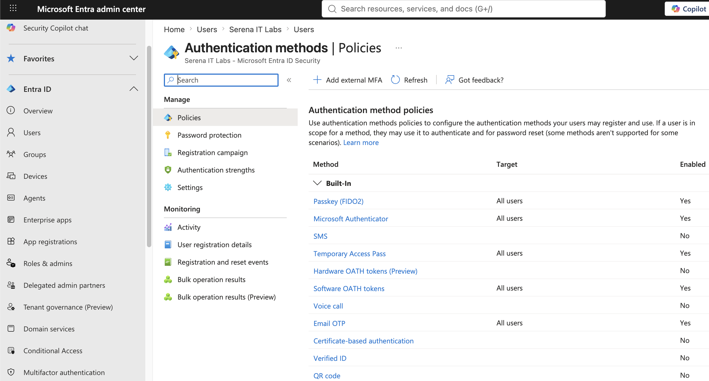
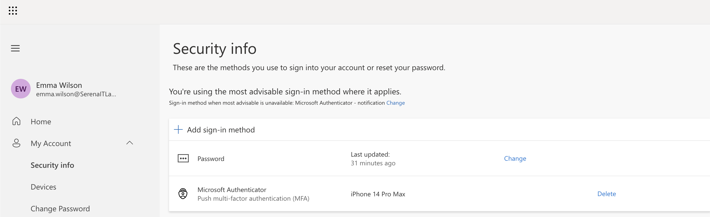
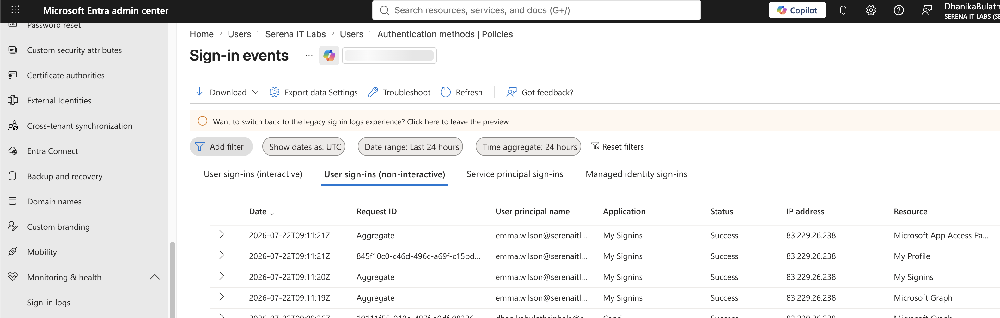
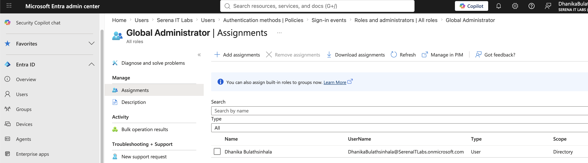
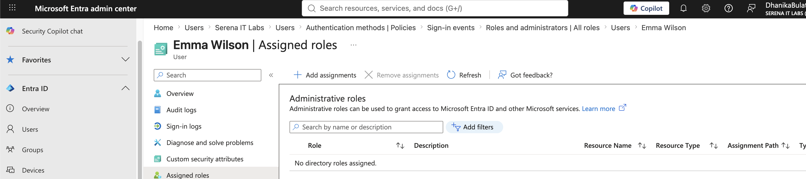
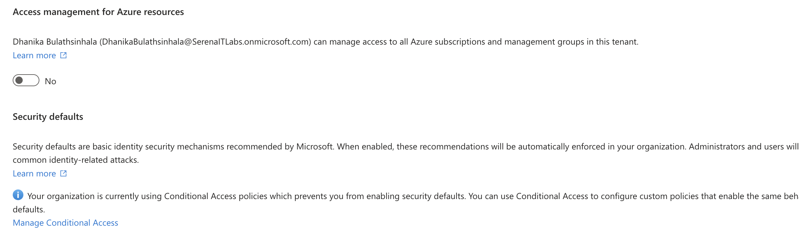
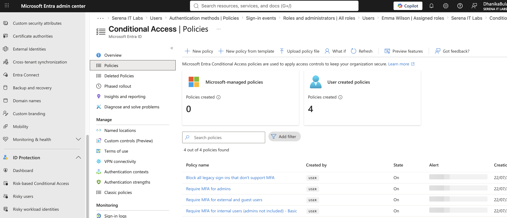

# Project 08 – Microsoft 365 Security & Identity Administration

## Overview

This project demonstrates practical security and identity administration within a Microsoft 365 Business Premium environment using Microsoft Entra ID.

The lab focused on authentication methods, multi-factor authentication (MFA), sign-in monitoring, administrative roles, least-privilege access, Security Defaults, and Conditional Access.

---

## Scenario

An organization needs to strengthen access to its Microsoft 365 environment while maintaining visibility into user authentication and administrative privileges.

As the Microsoft 365 administrator, the task is to review authentication methods, configure MFA requirements, investigate sign-in activity, review administrative roles, and examine tenant-level identity security controls.

---

## Objectives

- Navigate the Microsoft Entra Admin Center
- Review tenant identity information
- Review available authentication methods
- Configure and review MFA requirements
- Review user sign-in activity
- Review Microsoft Entra administrative roles
- Verify standard user role assignments
- Understand least-privilege administration
- Review Security Defaults
- Review Conditional Access configuration

---

## Lab Environment

| Component | Details |
|---|---|
| Microsoft 365 Plan | Microsoft 365 Business Premium |
| Identity Platform | Microsoft Entra ID |
| Administration Portal | Microsoft Entra Admin Center |
| Authentication | Multi-Factor Authentication |
| Environment | Cloud-based Microsoft 365 Tenant |

---

## Project Structure

```text
08-Security-and-Identity-Administration
├── README.md
└── Screenshots
    ├── 01_Entra_Identity_Overview.png
    ├── 02_Authentication_Methods.png
    ├── 03_MFA_Configuration.png
    ├── 04_Sign_In_Logs.png
    ├── 05_Admin_Roles.png
    ├── 06_User_Assigned_Roles.png
    ├── 07_Security_Defaults.png
    └── 08_Conditional_Access.png
```

---

## Microsoft Entra Identity Overview

The Microsoft Entra Admin Center was used to review the organization's identity environment and tenant information.



---

## Authentication Methods

Available authentication methods were reviewed to understand the authentication options that can be made available to organizational users.

Methods reviewed included Microsoft Authenticator and other supported authentication mechanisms.



---

## Multi-Factor Authentication

Multi-factor authentication configuration was reviewed to understand how additional authentication requirements can protect Microsoft 365 accounts.

MFA provides an additional security layer beyond username and password authentication.



---

## Sign-In Monitoring

Microsoft Entra sign-in logs were reviewed to understand how administrators can investigate user authentication activity.

Sign-in information can assist with troubleshooting failed logins and identifying unusual authentication activity.



---

## Administrative Roles

Microsoft Entra administrative roles were reviewed, including roles relevant to Microsoft 365 administration and IT support.

Examples include:

- Global Administrator
- User Administrator
- Helpdesk Administrator
- Exchange Administrator
- Teams Administrator
- SharePoint Administrator



---

## User Role Assignment

The administrative role assignments of a standard lab user were reviewed.

This demonstrated the distinction between standard user accounts and privileged administrative accounts.



---

## Least-Privilege Administration

Administrative roles provide a method for assigning only the permissions required to perform specific responsibilities.

For example, IT support personnel can be assigned appropriate support or user-management roles instead of receiving unrestricted Global Administrator privileges.

This supports the principle of least privilege.

---

## Security Defaults

Microsoft Entra Security Defaults were reviewed to understand Microsoft's baseline identity security protections.

The configuration was reviewed without making unnecessary changes to the tenant's existing security posture.



---

## Conditional Access

The Conditional Access administration interface was reviewed to understand how organizations can apply access controls based on users, applications, authentication requirements, and other conditions.

Detailed Conditional Access implementation will be covered separately in the Microsoft Entra ID portfolio.



---

## Skills Demonstrated

- Microsoft Entra ID administration
- Microsoft 365 identity administration
- Multi-factor authentication
- Authentication method administration
- Sign-in monitoring
- Authentication troubleshooting
- Administrative role management
- Role-based access control awareness
- Least-privilege administration
- Security Defaults
- Conditional Access awareness
- Microsoft 365 security administration

---

## Lessons Learned

- Microsoft Entra ID provides centralized identity and access management for Microsoft 365.
- MFA provides additional protection beyond password-only authentication.
- Authentication methods should be selected according to organizational security requirements.
- Sign-in logs provide useful information for investigating authentication and access problems.
- Administrative roles allow responsibilities to be separated without granting every administrator unrestricted privileges.
- Least privilege reduces unnecessary administrative access.
- Security Defaults provide baseline identity protections.
- Conditional Access provides more granular control over authentication and resource access.
- Identity troubleshooting is an important component of Microsoft 365 IT support.

---

## Next Project

**Project 09 – Microsoft 365 Help Desk Administration**

The next project will combine Microsoft 365 administration skills into realistic IT support scenarios involving user onboarding, password resets, licensing, group access, mailbox permissions, and user offboarding.

---

**Status:** Completed