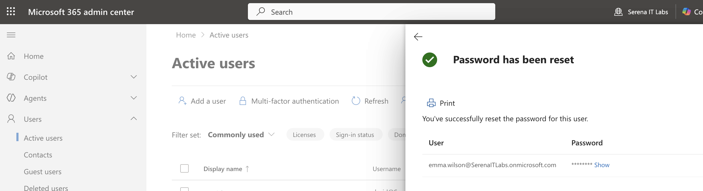
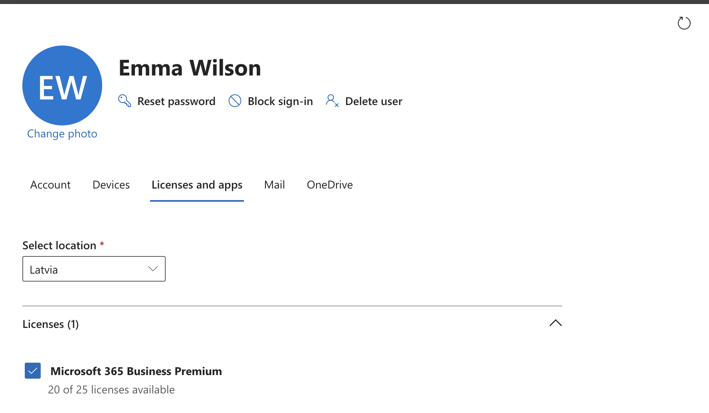
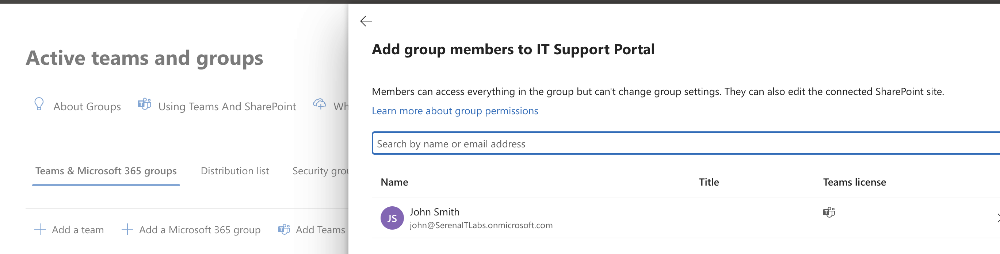
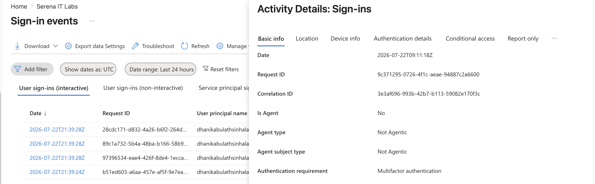
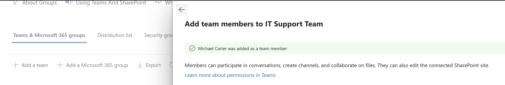

# Project 09 – Microsoft 365 Help Desk Administration

## Overview

This project demonstrates practical Microsoft 365 help desk administration through realistic support scenarios.

The lab focused on password reset, license troubleshooting, group access management, sign-in troubleshooting, and new-user onboarding. Additional support workflows involving shared mailbox delegation, OneDrive file recovery, and user offboarding were reviewed conceptually but were not executed as part of this project.

---

## Scenario

An IT Support technician receives several Microsoft 365 service requests involving user access, licensing, authentication, and onboarding.

The objective is to resolve common support issues using the Microsoft 365 Admin Center and Microsoft Entra Admin Center while following a structured troubleshooting and administration workflow.

---

## Objectives

- Reset a user password
- Troubleshoot Microsoft 365 licensing
- Manage group access
- Review sign-in activity
- Investigate authentication issues
- Onboard a new Microsoft 365 user
- Review shared mailbox delegation workflows
- Review OneDrive file recovery workflows
- Review user offboarding procedures

---

## Lab Environment

| Component | Details |
|---|---|
| Microsoft 365 Plan | Microsoft 365 Business Premium |
| Administration Portal | Microsoft 365 Admin Center |
| Identity Platform | Microsoft Entra ID |
| Email Platform | Exchange Online |
| Storage Platform | OneDrive for Business |
| Environment | Cloud-based Microsoft 365 Tenant |

---

## Project Structure

```text
09-Microsoft-365-Help-Desk-Administration
├── README.md
└── Screenshots
    ├── 01_Password_Reset_Ticket.png
    ├── 02_License_Troubleshooting.png
    ├── 03_Group_Access_Request.png
    ├── 04_Sign_In_Troubleshooting.png
    └── 05_New_User_Onboarding.png
```

---

## Scenario 1 – Password Reset

A lab user was treated as a support ticket involving forgotten or inaccessible credentials.

The password was reset through the Microsoft 365 Admin Center.

This demonstrated a common L1 help desk task.



---

## Scenario 2 – License Troubleshooting

The user's Microsoft 365 license assignment was reviewed to verify access to Microsoft 365 services.

This simulated a support case where a user could not access services such as Outlook or Teams because licensing needed to be checked.



---

## Scenario 3 – Group Access Request

A lab user was added to an organizational group to simulate an access request.

This demonstrated how Microsoft 365 administrators can manage user access through group membership.



---

## Scenario 4 – Sign-In Troubleshooting

Microsoft Entra sign-in logs were reviewed to investigate user authentication activity.

The sign-in information was used to examine:

- Sign-in status
- Application accessed
- Authentication requirement
- Login activity
- Troubleshooting information

This demonstrated how administrators can investigate reports of failed or problematic Microsoft 365 sign-ins.



---

## Scenario 5 – New User Onboarding

A new fictional employee account was created to simulate an onboarding request.

The onboarding process included:

- Creating the user account
- Assigning a Microsoft 365 Business Premium license
- Configuring standard user access
- Adding the user to appropriate organizational groups



---

## Additional Help Desk Workflows Reviewed

The following workflows were reviewed conceptually but were not executed as part of this project.

### Shared Mailbox Delegation

The process for granting access to a shared mailbox was reviewed.

Typical permissions include:

- Full Access
- Send As

This workflow is commonly used when employees need access to shared addresses such as IT support or departmental mailboxes.

### OneDrive File Recovery

The OneDrive file recovery workflow was reviewed.

A typical support case would involve restoring an accidentally deleted document through the OneDrive Recycle Bin.

### User Offboarding

The Microsoft 365 user offboarding process was reviewed.

Typical offboarding actions may include:

- Blocking user sign-in
- Resetting credentials
- Revoking active sessions
- Removing group memberships
- Removing Microsoft 365 licenses
- Reviewing mailbox ownership
- Reviewing OneDrive data
- Preserving organizational information where required

---

## Skills Demonstrated

- Microsoft 365 help desk administration
- Password reset procedures
- Microsoft 365 license troubleshooting
- Group membership administration
- Access management
- Microsoft Entra sign-in troubleshooting
- Authentication monitoring
- User provisioning
- Employee onboarding
- Microsoft 365 Admin Center navigation
- Microsoft Entra Admin Center navigation
- User lifecycle management fundamentals

---

## Lessons Learned

- Password resets are one of the most common Microsoft 365 help desk tasks.
- Licensing should be checked when users cannot access Microsoft 365 applications or services.
- Group membership provides a scalable method for managing organizational access.
- Microsoft Entra sign-in logs provide useful information for troubleshooting authentication issues.
- New-user onboarding requires coordination between identity, licensing, and access management.
- Shared mailbox access, OneDrive recovery, and user offboarding are important support workflows within Microsoft 365.
- Structured troubleshooting helps IT Support technicians identify and resolve Microsoft 365 issues efficiently.

---

## Next Project

**Project 10 – Microsoft 365 Administration Case Study**

The next project will combine Microsoft 365 administration skills into a complete enterprise user lifecycle scenario covering onboarding, access management, collaboration services, and offboarding planning.

---

**Status:** Completed