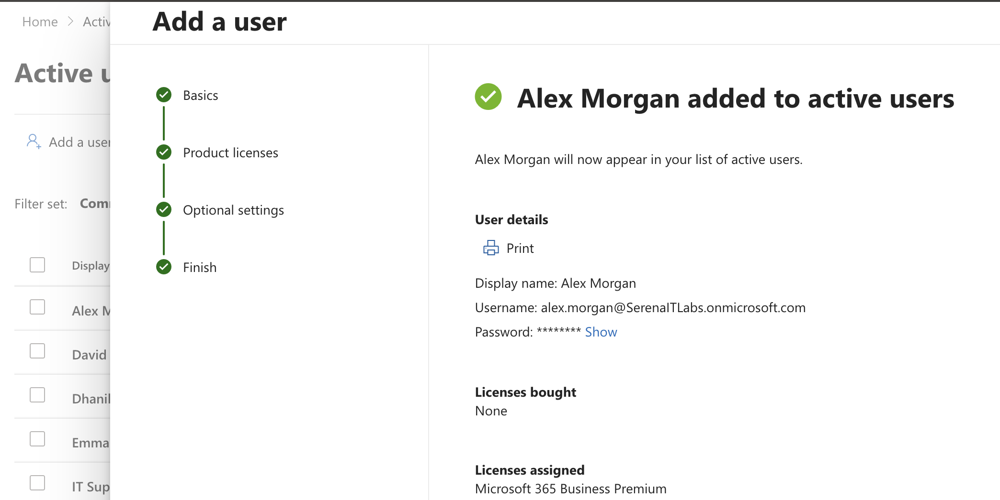
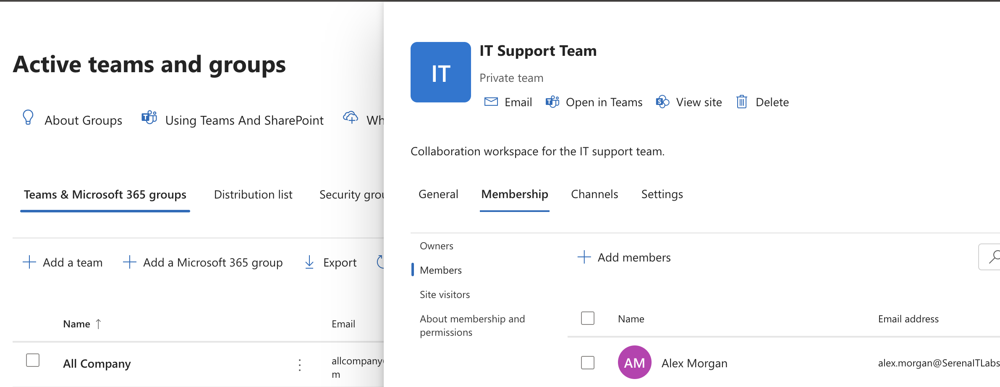
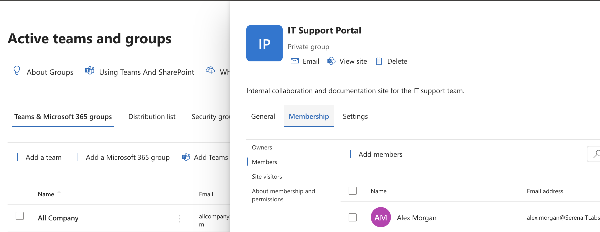
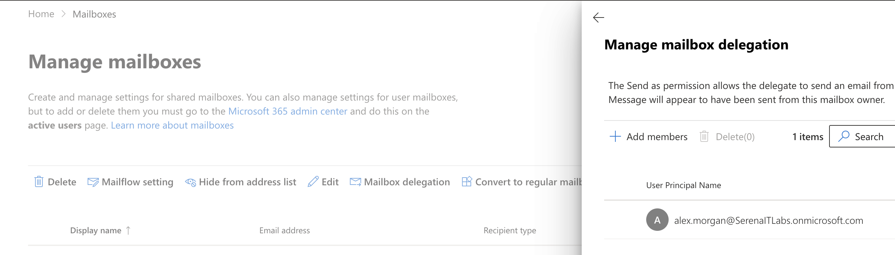
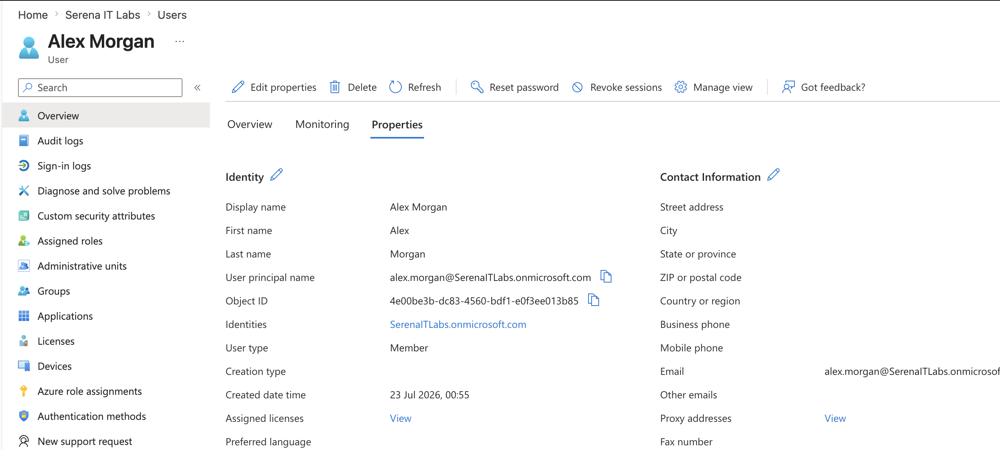
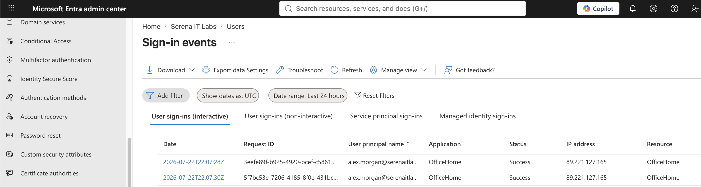

# Project 10 – Microsoft 365 Administration Case Study

## Overview

This project demonstrates an end-to-end Microsoft 365 employee onboarding workflow within a Microsoft 365 Business Premium environment.

The case study combines user provisioning, licensing, group membership, Microsoft Teams access, SharePoint access, Exchange Online shared mailbox permissions, identity verification, and sign-in validation into a single enterprise administration scenario.

An offboarding checklist was also created to document the corresponding user lifecycle process.

---

## Scenario

A new employee, Alex Morgan, joins the IT department and requires access to the organization's Microsoft 365 environment.

As the Microsoft 365 administrator, the objective is to provision the employee's account, assign the required license, configure access to organizational resources, verify identity configuration, and confirm successful authentication.

The project also documents the administrative steps that would be required when the employee eventually leaves the organization.

---

## Objectives

- Provision a new Microsoft 365 user
- Assign Microsoft 365 Business Premium licensing
- Configure security and Microsoft 365 group membership
- Configure Microsoft Teams access
- Configure SharePoint access
- Configure Exchange Online shared mailbox permissions
- Verify Microsoft Entra ID configuration
- Validate successful user authentication
- Apply least-privilege principles
- Document an employee offboarding workflow

---

## Lab Environment

| Component | Details |
|---|---|
| Microsoft 365 Plan | Microsoft 365 Business Premium |
| Identity Platform | Microsoft Entra ID |
| Email Platform | Exchange Online |
| Collaboration | Microsoft Teams |
| Content Management | SharePoint Online |
| Administration | Microsoft 365 Admin Center |
| Environment | Cloud-based Microsoft 365 Tenant |

---

## Project Structure

```text
10-Microsoft-365-Administration-Case-Study
├── README.md
├── OFFBOARDING-CHECKLIST.md
└── Screenshots
    ├── 01_User_Provisioning.png
    ├── 02_Group_Access.png
    ├── 03_Teams_Access.png
    ├── 04_SharePoint_Access.png
    ├── 05_Shared_Mailbox_Access.png
    ├── 06_Identity_Verification.png
    └── 07_Sign_In_Verification.png
```

---

## Employee Onboarding Workflow

The onboarding process followed a structured user lifecycle workflow:

```text
User Provisioning
       ↓
License Assignment
       ↓
Group Membership
       ↓
Teams Access
       ↓
SharePoint Access
       ↓
Shared Mailbox Access
       ↓
Identity Verification
       ↓
Sign-In Validation
```

---

## 1. User Provisioning

A new standard user account was created for Alex Morgan through the Microsoft 365 Admin Center.

The account was provisioned as a normal organizational user without unnecessary administrative privileges.

A Microsoft 365 Business Premium license was assigned to provide access to the required Microsoft 365 services.



---

## 2. Group Access

The new employee was added to the appropriate organizational groups, including IT-related groups required for the employee's role.

Group-based access provides a scalable approach to managing permissions instead of configuring resources independently for every user.


---

## 3. Microsoft Teams Access

Alex was added as a member of the `IT Support Team`.

The user was configured as a member rather than an owner, demonstrating the principle of assigning only the access required for the employee's responsibilities.



---

## 4. SharePoint Access

Access to the `IT Support Portal` SharePoint environment was configured and verified.

This provides the employee with access to internal IT documentation and collaboration resources required for the role.



---

## 5. Shared Mailbox Access

Exchange Online permissions were configured for the `IT Support` shared mailbox.

The required mailbox delegation included:

- Full Access
- Send As

This allows the employee to manage support communications using the organization's shared IT mailbox.



---

## 6. Identity Verification

The employee's identity configuration was reviewed through Microsoft Entra ID.

The review included:

- Account status
- User type
- License assignment
- Group membership
- Administrative role assignment

The account remained a standard organizational user without unnecessary administrative privileges.



---

## 7. Sign-In Verification

The employee account was used to perform an initial Microsoft 365 sign-in.

Microsoft Entra sign-in logs were then reviewed to verify successful authentication and confirm that the account could access the Microsoft 365 environment.



---

## Offboarding Planning

An `OFFBOARDING-CHECKLIST.md` operational document was created to document the corresponding employee departure workflow.

The checklist covers activities such as:

- Blocking sign-in
- Revoking active sessions
- Resetting credentials
- Removing group memberships
- Removing Teams access
- Reviewing shared mailbox permissions
- Reviewing Exchange mailbox requirements
- Reviewing OneDrive organizational data
- Removing SharePoint access
- Recovering Microsoft 365 licensing
- Preserving required organizational data
- Documenting account closure

The account was not deleted as part of this project.

---

## Skills Demonstrated

- Microsoft 365 administration
- Employee onboarding
- User account provisioning
- Microsoft 365 license management
- Microsoft Entra ID administration
- Group membership management
- Microsoft Teams administration
- SharePoint Online access management
- Exchange Online mailbox delegation
- Identity and access management
- Sign-in monitoring
- Least-privilege administration
- User lifecycle management
- Joiner-Mover-Leaver fundamentals
- IT operational documentation

---

## Lessons Learned

- Microsoft 365 onboarding involves multiple interconnected services rather than only creating a user account.
- Licensing must be correctly assigned before users can access required Microsoft 365 services.
- Groups provide a scalable approach to managing organizational access.
- Teams, SharePoint, and Exchange permissions should reflect the employee's business responsibilities.
- Administrative privileges should not be assigned unless they are required for the user's role.
- Microsoft Entra sign-in logs can be used to verify authentication and troubleshoot access problems.
- Employee offboarding requires coordinated removal of access while preserving organizational data where required.
- Standardized onboarding and offboarding procedures improve consistency and reduce access-management errors.

---

## Portfolio Outcome

This case study integrates the Microsoft 365 administration skills developed throughout the portfolio into a complete employee lifecycle scenario.

The portfolio demonstrates hands-on experience with:

- Microsoft 365 Admin Center
- Microsoft Entra ID
- Exchange Online
- Microsoft Teams
- SharePoint Online
- OneDrive for Business
- User and group administration
- License management
- Identity security
- Help desk administration
- User lifecycle management

---

## Next Portfolio

**Microsoft Entra ID Administration**

The next portfolio will focus more deeply on cloud identity and access management, including authentication, administrative roles, Conditional Access, identity security, and access-control scenarios.

---

**Status:** Completed